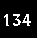
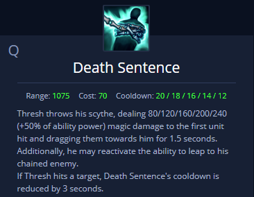

# LeagueShock
 Using image analysis to pull some info from League of Legends

League of Legends is a multiplayer online battle arena video game and is a highly competitive, fast paced action-strategy game. one of the playable characters Thresh has four abilities, like every other character, and the goal was to track these abilities along with other information over the course of a game.

When an ability is used there is a certain amount of time that must pass before it can be used again and this number is displayed on the screen. By taking screenshots and then preforming some low level image processing one can obtain a 2d binary image of black (0) and white (255) based on the grayscale value after thresholding. 

At first the idea was to use machine learning to determine what numbers were being displayed but after further consideration the images were much too linear seeing as all images ahd the same font and size. Instead Each image was segmented into individual numbers where they could be compared to some examples I had already captured to produce usable integers.

  

"1"+"3"+"4" = "134"

ans = (int)"134"

With this I could track my ability usage as well as my health and mana over the game and in some cases I could track if the ability I had used had made contact with an enemy like in the case of the ability Death Sentance.

With this ability reducing its cooldown time if it hits it becomes simple to monitor if the ability made contact or not providing more valuable information that can be tracked.

League of Legends already provides one with allot of information about each game that is played but my goal was to see just how much more I could provide myself.

While I only created this for Thresh It should be easily adaptable to other champions given changes are made in the main class.

Another fun implementation I made was that every time the program detected a missed Death Sentance I sent a signal through the serial port to an Arduino to turn on a relay controlled tens unit providing myself with a small shock as a fun repercussion making the game even more tensious.

For some reason I also decided to make the Read.py class one class and not split it up into multiple smaller classes which would.

1. save allot of time copying and pasting similar code

2. reduce the overall length of the class

3. follow best practices

However this was just a personal project and a great reminder to myself how much easier splitting up the work is and why my professors stressed it so heavily.
